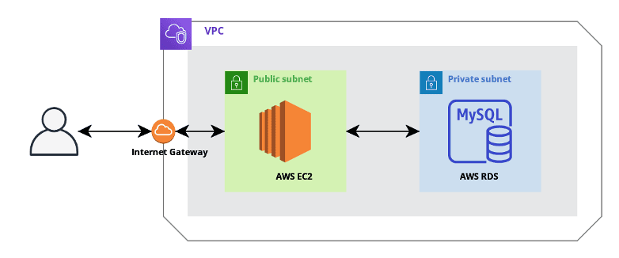

# Daily Mission web service

### 1일 1알고리즘,  코딩테스트 스터디 등 온라인 모임을 관리할 수 있는 서비스입니다.
### 일일 미션은 누구나 생성가능하고 참여할 수 있습니다.
### 미션에 참여하는 사람은 일일 포스팅을 작성해 미션 인증을 해야합니다.

##### 예) 1일 1알고리즘 풀이

 

### 사용한 기술 스택
+ Spring Boot
+ Spring Security
+ JPA
+ MySQL
+ OAuth2.0
+ Junit5
+ AWS(infra) 
+ Nginx
+ 
 
 

 

## cascade 오류
부모가 둘이 Entity (fk가 둘)인 상태에서 CascadeType.ALL로 설정해서 Referential integrity constraint violation 발생
-> cascade 사용하지 않고 수동으로 삭제, 추가 해줌

 
 

## 추가할 것
실시간 채팅
